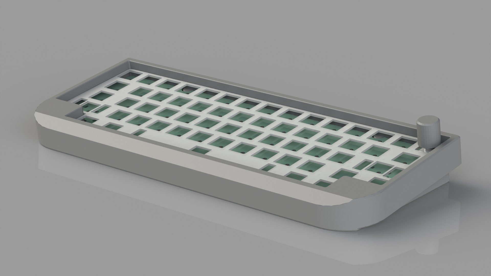

# **This Is a Skibidi Sigma HHKB Keyboard**

gummy o-ring mount

rotary encoder

S series unified daughterboard https://github.com/Unified-Daughterboard/UDB-S

original custom design hhkb only pcb (kicad 8)

custom case (solidworks 2023), inspiared by the bakeneko 60 https://github.com/kkatano/bakeneko-60

plate generated by ai03 plate generator and modified in cad https://kbplate.ai03.com/

